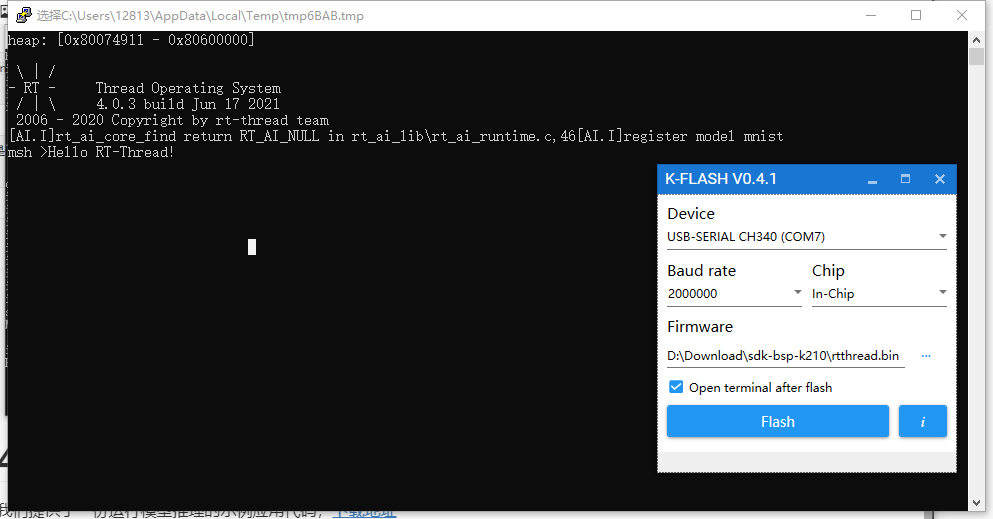

中文: [Chinese](RT-AK之K210插件快速上手.md)


<center><h1>Quick Start for RT-AK with Plugin K210</h1></center>

[TOC]

# 1. Preparation

Please prepare these important materials as below:

| Index |                      Prepare                      | Example                                               |
| :---: | :-----------------------------------------------: | ----------------------------------------------------- |
|   1   | Hardware、`BSP`  and Cross compilation tool chain | `K210 BSP` <br>`xpack-riscv-none-embed-gcc-8.3.0-1.2` |
|   2   |                      `RT-AK`                      | RT-AK                                                 |
|   3   |                     AI model                      | `./rt_ai_tools/Model/mnist.tflite`                    |
|   4   |               `K210` offical tools                | `NNCase`<br>`KFlash`                                  |

## 1.1 BSP

- Hardware

  Kendryte `KD233` or BOYA `YB-DKA01`，or other K210 based embed development board

  or contact us: business@rt-thread.com

- `BSP`，[Website](http://117.143.63.254:9012/www/RT-AK/sdk-bsp-k210.zip)

- Cross compilation tool chain (Windows)

  [xpack-riscv-none-embed-gcc-8.3.0-1.2-win32-x64.zip](https://github.com/xpack-dev-tools/riscv-none-embed-gcc-xpack/releases/download/v8.3.0-1.2/xpack-riscv-none-embed-gcc-8.3.0-1.2-win32-x64.zip) | `Version: v8.3.0-1.2`

## 1.2 RT-AK

Please clone `RT-AK` 

```shell
$ git clone https://github.com/RT-Thread/RT-AK.git edge-ai
```

## 1.3 AI model

`k210` offical tool supports three kinds of AI model typies： `TFLite`、`Caffe`、`ONNX`

Transform the AI model into kmodel, which is located at `RT-AK/rt_ai_tools/Models/mnist.tflite`

## 1.4 k210 offical tool

1. `NNCase`：NNCase is located at `RT-AK/rt_ai_tools/platforms/plugin_k210/k_tools` 

   > You can also download it form [Github](https://github.com/kendryte/nncase/releases)

2. [`K-Flash`](https://github.com/kendryte/kendryte-flash-windows/releases/download/v0.4.1/K-Flash.zip)

# 2. Execution steps

## 2.1 Basic commands

Please run `aitools` at `edge-ai/RT-AK/tools`


During the running process of the RT-AK

1. K210 plug-in will be pulled from `github` to  `RT-AK/rt_ai_tools/platforms` automatically
2. AI model will be integrated in the `BSP`, but not include the application codes of the AI model, an example is presented at the end of the doc
3. In the PATH of  `RT-AK/rt_ai_tools/platforms/plugin_k210`,  `<model_name>.kmodel` and  `convert_report.txt`  will be generated 
   - `<model_name>.kmodel`  AI model for K210 
   - `convert_report.txt` `log` for AI model transformation 


```shell
# Basic commands
python aitools.py --project=<your_project_path> --model=<your_model_path> --model_name=<your_model_name> --platform=k210 --clear

# Examples
$ D:\Project\edge-ai\RT-AK\rt_ai_tools>python aitools.py --project=D:\Project\K210_Demo\k210_rthread_bsp --model=.\Models\mnist.tflite --model_name=mnist --platform=k210 --embed_gcc=D:\Project\k210_third_tools\xpack-riscv-none-embed-gcc-8.3.0-1.2\bin --dataset=.\platforms\plugin_k210\datasets\mnist_datasets
```

An successful demo for RT-AK：


## 2.2 Other additional notes

```bash
# no model quantization, --inference_type
$ python aitools.py --project=<your_project_path> --model=<your_model_path> --platform=k210  --inference_type=float

# no model quantization, set path for the cross compilation tool chain
$ python aitools.py --project=<your_project_path> --model=<your_model_path> --platform=k210 --embed_gcc=<your_RISCV-GNU-Compiler_path> --inference_type=float

# model quantization with uint8 type, accelerating computation with KPU, dataset format is image
$ python aitools.py --project=<your_project_path> --model=<your_model_path> --platform=k210 --embed_gcc=<your_RISCV-GNU-Compiler_path> --dataset=<your_val_dataset>

# model quantization with uint8 type, accelerating computation with KPU, dataset format is not image
$ python aitools.py --project=<your_project_path> --model=<your_model_path> --platform=k210 --embed_gcc=<your_RISCV-GNU-Compiler_path> --dataset=<your_val_dataset> --dataset_format=raw

# example
$ python aitools.py --project="D:\Project\k210_val" --model="./Models/facelandmark.tflite" --model_name=facelandmark --platform=k210 --embed_gcc="D:\Project\k210_third_tools\xpack-riscv-none-embed-gcc-8.3.0-1.2\bin" --dataset="./platforms/plugin_k210/datasets/images"
```

## 2.3 Input parameters of RT-AK

| Parameter    | Description                                                  |
| ------------ | ------------------------------------------------------------ |
| --project    | `OS+BSP` project folder，**should be assigned by user**      |
| --model      | AI model PATH. Default is `./Models/keras_mnist.h5`          |
| --model_name | New AI model name after model transformation. Default is `network` |
| --platform   | Target platform, such as: stm32, k210，Default is  `example` |
| --embed_gcc  | PATH for cross compilation tool chain                        |
| --dataset    | Dataset for AI model quantization                            |

# 3. Compilation & Download

Compilation:

```shell
scons -j 6	
```

`rtthread.bin` will be generated in the folder

Download：

By using the K-Flash, you can download the `rtthread.bin` into the test board



# 4. Explanation for embed application project

We have provide a open source test project, which you can download from [here](http://117.143.63.254:9012/www/RT-AK/mnist_app_k210.zip)

## 4.1 Work flow of the RT-Thread RTOS

**System initialization**：

- System clock initialization

**Loading and running the AI model**：

- Registering the AI model
- Finding AI model
- Initializing AI model
- Inferring AI model
- Getting results

## 4.2 Core codes

```c
// main.c
/* Set CPU clock */
sysctl_clock_enable(SYSCTL_CLOCK_AI);  // System clock initialization
...

/* AI modol inference */
mymodel = rt_ai_find(MY_MODEL_NAME);  // find AI model
if (rt_ai_init(mymodel, (rt_ai_buffer_t *)IMG9_CHW) != 0)  // Initializing AI model
...
if(rt_ai_run(mymodel, ai_done, NULL) != 0)    // Inferring
...
output = (float *)rt_ai_output(mymodel, 0);  // Getting results

/* Getting the high */
for(int i = 0; i < 10 ; i++)
{
    // printf("pred: %d, scores: %.2f%%\n", i, output[i]*100);
    if(output[i] > scores  && output[i] > 0.2)
    {
        prediction = i;
        scores = output[i];
    }
}
```

How to change the input image:

In `applications` folder, you can only modify the line 18 and line 51

The MNIST demo can be download from [Github](https://github.com/EdgeAIWithRTT/Project5-Mnist_RT-AK_K210)

## 4.3 Results of MNIST demo

