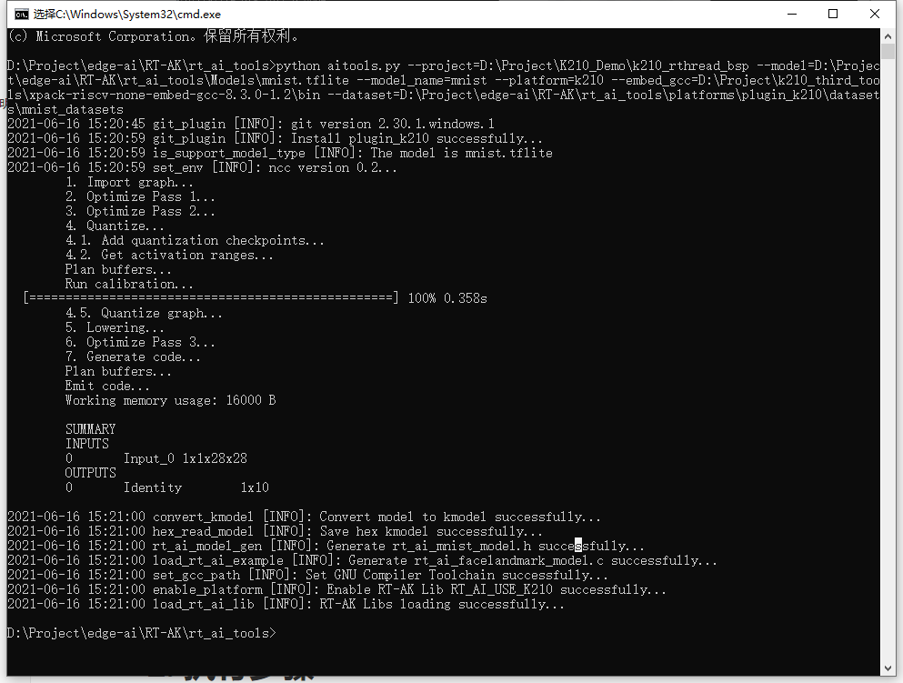

<center><h1>RT-AK 之 K210插件快速上手</h1></center>

[TOC]

# 1. 准备工作

准备以下四份**重要重要重要**的材料：

| Index |              Prepare              | Example                                               |
| :---: | :-------------------------------: | ----------------------------------------------------- |
|   1   | 硬件以及 `BSP` 以及交叉编译工具链 | `K210 BSP` <br>`xpack-riscv-none-embed-gcc-8.3.0-1.2` |
|   2   |              `RT-AK`              | RT-AK 代码克隆到本地                                  |
|   3   |           神经网络模型            | `./rt_ai_tools/Model/mnist.tflite`                    |
|   4   |          `K210` 原厂工具          | `NNCase`：模型转换工具<br>`KFlash`：固件下载工具      |

## 1.1 BSP

- 硬件

  嘉楠堪智的 `KD233` 或者亚博 `YB-DKA01`

- 这里，我们准备好了一份 `BSP`，[下载地址](http://117.143.63.254:9012/www/RT-AK/sdk-bsp-k210.zip)

## 1.2 RT-AK 准备

将 `RT-AK` 克隆到本地

```shell
$ git clone https://github.com/RT-Thread/RT-AK.git edge-ai
```

## 1.3 神经网络模型

由于 `k210` 原厂工具仅支持三种模型格式： `TFLite`、`Caffe`、`ONNX`

所以提前将 `keras` 神经网络模型转换成了 `tflite` 模型，位于 `RT-AK/rt_ai_tools/Models/mnist.tflite`

> 如果没有，请及时与我们联系

## 1.4 原厂工具

1. `NNCase`：已经提前下载好，位于 `RT-AK/rt_ai_tools/platforms/plugin_k210/k_tools` 路径下

   补充：[Github 下载地址](https://github.com/kendryte/nncase/releases)

2. `K-Flash` 烧录工具 [Github 下载地址](https://github.com/kendryte/kendryte-flash-windows/releases)

# 2. 执行步骤

> 代码将会自动使用 `NNCase` 模型转换工具，获得一个集成了 AI 的 BSP

内部的流程请看源码或者 `plugin_k210` 仓库下的 `readme` 文档

## 2.1 基础运行命令

请在 `edge-ai/RTAK/tools` 路径下运行该程序。


```shell
# 基础运行命令
python aitools.py --project=<your_project_path> --model=<your_model_path> --model_name=<your_model_name> --platform=k210 --clear

# 示例
$ D:\Project\edge-ai\RT-AK\rt_ai_tools>python aitools.py --project=D:\Project\K210_Demo\k210_rthread_bsp --model=.\Models\mnist.tflite --model_name=mnist --platform=k210 --embed_gcc=D:\Project\k210_third_tools\xpack-riscv-none-embed-gcc-8.3.0-1.2\bin --dataset=.\platforms\plugin_k210\datasets\mnist_datasets
```

RT-AK 之 K210 插件示例 Demo 运行成功界面：



## 2.2 其他运行命令补充说明

```bash
# 非量化，不使用 KPU 加速， --inference_type
$ python aitools.py --project=<your_project_path> --model=<your_model_path> --platform=k210  --inference_type=float

# 非量化，指定交叉编译工具链路径
$ python aitools.py --project=<your_project_path> --model=<your_model_path> --platform=k210 --embed_gcc=<your_RISCV-GNU-Compiler_path> --inference_type=float

# 量化为 uint8，使用 KPU 加速，量化数据集为图片
$ python aitools.py --project=<your_project_path> --model=<your_model_path> --platform=k210 --embed_gcc=<your_RISCV-GNU-Compiler_path> --dataset=<your_val_dataset>

# 量化为 uint8，使用 KPU 加速，量化数据集为音频之类非图片，--dataset_format
$ python aitools.py --project=<your_project_path> --model=<your_model_path> --platform=k210 --embed_gcc=<your_RISCV-GNU-Compiler_path> --dataset=<your_val_dataset> --dataset_format=raw

# 示例(量化模型，图片数据集)
$ python aitools.py --project="D:\Project\k210_val" --model="./Models/facelandmark.tflite" --model_name=facelandmark --platform=k210 --embed_gcc="D:\Project\k210_third_tools\xpack-riscv-none-embed-gcc-8.3.0-1.2\bin" --dataset="./platforms/plugin_k210/datasets/images"
```

## 2.3 运行参数说明

详见[3. 命令行参数详细说明](../README.md)

上述示例命令行的参数说明

| Parameter    | Description                                                  |
| ------------ | ------------------------------------------------------------ |
| --project    | `OS+BSP` 项目工程文件夹，默认为空，**需要用户指定**          |
| --model      | 神经网络模型文件路径，默认为 `./Models/keras_mnist.h5`       |
| --model_name | 神经网络模型转换后新的模型名，默认是 `network`               |
| --platform   | 指定目标平台信息，目前支持：`stm32`、`k210`，默认是 `example`，具体体可用的目标平台由 `platforms/xxx.json` 注册 |
| --embed_gcc  | 交叉编译工具链路径，**非必须**。如果有，则会更改 `rt_config.py` 文件，如果无指定，则需要在编译的时候指定该工具链路径 |
| --dataset    | 模型量化过程中所需要用到的数据集，只需要在设置 `--inference-type` 为 `uint8` 时提供这个参数 |

# 3. 编译 & 下载

如果在执行 RT-AK 得过程中添加了 `--embed_gcc` 这个参数，可跳过以下部分：

- 设置编译环境
  - 方法一： `set RTT_EXEC_PATH=<your_toolchains>`
  - 方法二：修改 `rtconfig.py` 文件，在第22行新增 `os.environ['RTT_EXEC_PATH'] = r'your_toolchains'`

编译：

```shell
scons -j 6	
```

如果编译正确无误，会产生 `rtthread.elf`、`rtthread.bin`文件。

其中 `rtthread.bin` 需要烧写到设备中进行运行。

下载：

​	可以看到，下载后得显示界面并没有什么变化，

​    那是因为 RT-AK 内部不提供应用程序代码，想要让 AI 模型成功运行，需要开发者们自行编写，在本文得末尾，我们提供了一份示例代码。


# 4. 示例应用代码说明

我们提供了一份运行模型推理的示例应用代码，[下载地址](http://117.143.63.254:9012/www/RT-AK/mnist_app_k210.zip)

下载解压，放置到 `<BSP>/applications` 路径下

编译烧录即可。

## 4.1 流程

**系统内部初始化**：

- 系统时钟初始化

**RT-AK Lib 模型加载并运行**：

- 注册模型（代码自动注册，无需修改）
- 找到注册模型
- 初始化模型，挂载模型信息，准备运行环境
- 运行（推理）模型
- 获取输出结果

## 4.2 核心代码

```c
// main.c
/* Set CPU clock */
sysctl_clock_enable(SYSCTL_CLOCK_AI);  // 使能系统时钟（系统时钟初始化）
...

// 注册模型的代码在 rt_ai_mnist_model.c 文件下的第31行，代码自动执行
// 模型的相关信息在 rt_ai_mnist_model.h 文件
/* AI modol inference */
mymodel = rt_ai_find(MY_MODEL_NAME);  // 找到注册模型
if (rt_ai_init(mymodel, (rt_ai_buffer_t *)IMG9_CHW) != 0)  // 初始化模型，传入输入数据
...
if(rt_ai_run(mymodel, ai_done, NULL) != 0)    // 模型推理一次
...
output = (float *)rt_ai_output(mymodel, 0);  // 获取模型输出结果

/* 对模型输出结果进行处理，该实验是Mnist，输出结果为10个概率值，选出其中最大概率即可 */
for(int i = 0; i < 10 ; i++)
{
    // printf("pred: %d, scores: %.2f%%\n", i, output[i]*100);
    if(output[i] > scores  && output[i] > 0.2)
    {
        prediction = i;
        scores = output[i];
    }
}
```

**如何更换模型输入数据补充说明**：

示例数据在 `applications` 文件夹下，模型不用重新训练，只需更改第18行和第51行即可

详细得 Mnist Demo 工程链接，包括训练和数据处理。 [Github](https://github.com/EdgeAIWithRTT/Project4-Mnist_RT-AK_K210)

## 4.3 结果显示

